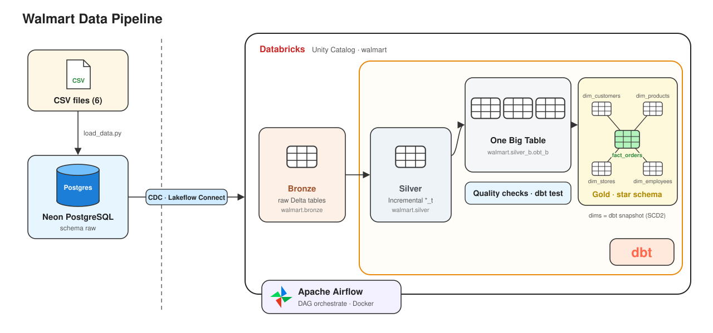

# Walmart Data Pipeline

Pipeline dữ liệu end-to-end cho bộ dữ liệu bán lẻ Walmart (giả lập): từ file CSV → PostgreSQL trên **Neon** → **Databricks** (bronze) → **dbt** biến đổi theo kiến trúc **Medallion** (bronze → silver → gold, star schema) → điều phối tự động bằng **Airflow** chạy trong **Docker**.

## Kiến trúc



```
CSV files
   │  walmart_dataset/load_data.py
   ▼
Neon PostgreSQL  (neondb.raw.*)
   │  Databricks Lakeflow Connect – pipeline "ingest_walmart"
   ▼
Databricks  walmart.bronze.*          ← dữ liệu thô
   │  dbt run (incremental)
   ▼
walmart.silver.*_t                    ← làm sạch, thêm processed_at
   │  dbt run
   ▼
walmart.silver_b.obt_b                ← One Big Table (JOIN 6 bảng)
   │  dbt ephemeral (eph_*) + dbt snapshot + dbt run
   ▼
walmart.gold.dim_*  +  walmart.gold.fact_orders   ← star schema

Airflow (Docker) điều phối toàn bộ chuỗi trên theo lịch.
```

## Công nghệ

| Thành phần | Công cụ |
|---|---|
| Lưu trữ nguồn | Neon (PostgreSQL serverless) |
| Nạp vào lakehouse | Databricks Lakeflow Connect (Ingestion pipeline, CDC) |
| Lakehouse | Databricks Free Edition, Unity Catalog, Delta tables |
| Biến đổi dữ liệu | dbt-core 1.12 + dbt-databricks |
| Điều phối | Apache Airflow 3.1 (Docker Compose) |
| Quản lý môi trường Python | uv |

## Dữ liệu

6 bảng trong [walmart_dataset/data/](walmart_dataset/data/):

| Bảng | Số dòng | Khoá |
|---|---|---|
| customers | 2.000 | `customer_id` |
| stores | 25 | `store_id` |
| products | 500 | `product_id` |
| employees | 250 | `employee_id` |
| orders | 10.000 | `order_id` |
| order_items | 30.021 | `order_item_id` |

Mọi bảng đều có `created_timestamp`, `updated_timestamp` và `is_active` (`Y`/`N`, xoá mềm), dùng cho incremental load và snapshot.

## Cấu trúc thư mục

```
DATA_PROJECT/
├── walmart_dataset/
│   ├── data/                  # 6 file CSV
│   ├── ddl/walmart_schema.sql # DDL tạo bảng
│   └── load_data.py           # nạp CSV → Neon (schema raw)
├── walmart_dbt/               # dự án dbt
│   ├── models/
│   │   ├── source/source.yml  # khai báo nguồn walmart.bronze
│   │   ├── silver/            # 6 model incremental *_t + test
│   │   ├── silver_b/          # refer (view JOIN) + obt_b (One Big Table)
│   │   └── gold/
│   │       ├── ephemeral/     # eph_* : tách OBT thành từng thực thể
│   │       └── Fact/          # fact_orders + test
│   ├── snapshots/             # dim_* (SCD Type 2)
│   ├── macros/custom_schema.sql
│   └── dbt_project.yml
├── airflow/
│   ├── dags/orchestrate.py    # DAG điều phối toàn pipeline
│   ├── scripts/trigger_ingestion.py  # kích hoạt pipeline Databricks
│   ├── Dockerfile             # Airflow + dbt (venv riêng)
│   └── docker-compose.yml
└── pyproject.toml             # phụ thuộc Python (uv)
```

## Các lớp dữ liệu

### Bronze — `walmart.bronze`
Bản sao nguyên trạng 6 bảng từ Neon, do pipeline `ingest_walmart` của Databricks tạo và cập nhật. Không sửa trực tiếp.

### Silver — `walmart.silver`
6 model `*_t` dạng **incremental** (`unique_key` = khoá chính). Lần đầu tạo cả bảng, các lần sau chỉ MERGE dòng có `updated_timestamp` mới hơn. Thêm cột `processed_at`. Test `not_null` / `unique` trong [properties.yml](walmart_dbt/models/silver/properties.yml).

### Silver business — `walmart.silver_b`
- `refer` (view): JOIN `orders` với `customers`, `order_items`, `products`, `stores`, `employees`, đổi tên cột trùng bằng tiền tố (`customer_`, `store_`…).
- `obt_b` (table): One Big Table đọc từ `refer`.

### Gold — `walmart.gold` (star schema)
- `eph_*` (ephemeral): `SELECT DISTINCT` từng nhóm cột từ `obt_b`, không tạo bảng.
- `dim_customers`, `dim_products`, `dim_stores`, `dim_employees`: **dbt snapshot** (SCD Type 2, strategy `timestamp`) — giữ lịch sử thay đổi với `dbt_valid_from` / `dbt_valid_to` (bản hiện hành có `dbt_valid_to = 9999-12-31`).
- `fact_orders`: mỗi dòng là một sản phẩm trong một đơn hàng, kèm khoá nối tới các bảng dim. Có test `unique` và `relationships`.

Macro [custom_schema.sql](walmart_dbt/macros/custom_schema.sql) ghi đè `generate_schema_name` để model nằm đúng schema `silver`, `gold`… thay vì `dbt_schema_silver`.

## Cài đặt

### 1. Môi trường Python
```powershell
uv sync
```

### 2. Neon
Tạo project trên Neon, rồi tạo file `.env` ở thư mục gốc:
```
DATABASE_URL=postgresql://<user>:<password>@<host>/neondb?sslmode=require
```
Nạp dữ liệu:
```powershell
uv run python walmart_dataset/load_data.py
```

### 3. Databricks
1. **Catalog → Connections**: tạo connection PostgreSQL tới Neon.
2. **Jobs & Pipelines → Ingestion pipeline**: nguồn `neondb.raw` (6 bảng), đích catalog `walmart`, schema `bronze`.
   Nếu báo lỗi replication: bật **Logical Replication** trong Neon project settings.

### 4. dbt
Tạo `walmart_dbt/profiles.yml` (đã gitignore):

Kiểm tra và chạy:
```powershell
cd walmart_dbt
uv run dbt debug
uv run dbt build        # models + snapshots + tests
```

### 5. Airflow
Đặt `DATABRICKS_PIPELINE_ID` trong [docker-compose.yml](airflow/docker-compose.yml) bằng ID pipeline ingestion, rồi:
```powershell
cd airflow
docker compose build
docker compose up -d
```
Mở http://localhost:8080, bật DAG `orchestrate`.

## DAG `orchestrate`

```
ingest → source_freshness → silver_technical → silver_business → silver_business_tests
       → gold_ephemeral → gold_dimensions → gold_facts
```

| Task | Lệnh |
|---|---|
| `ingest` | `trigger_ingestion.py`: chạy pipeline Databricks và chờ hoàn tất |
| `source_freshness` | `dbt source freshness` |
| `silver_technical` | `dbt run --select silver` |
| `silver_business` | `dbt run --select silver_b` |
| `silver_business_tests` | `dbt test --select silver_b` |
| `gold_ephemeral` | `dbt run --select gold.ephemeral` |
| `gold_dimensions` | `dbt snapshot` |
| `gold_facts` | `dbt run --select gold.Fact` |


## Bảo mật

`.env`, `walmart_dbt/profiles.yml` đều nằm trong `.gitignore`. 
